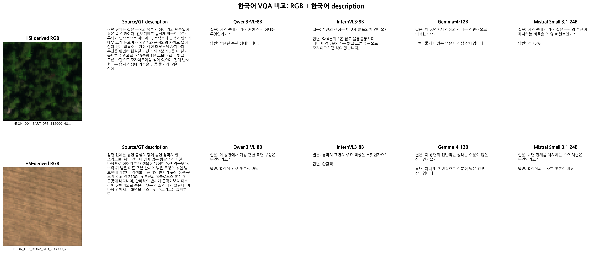
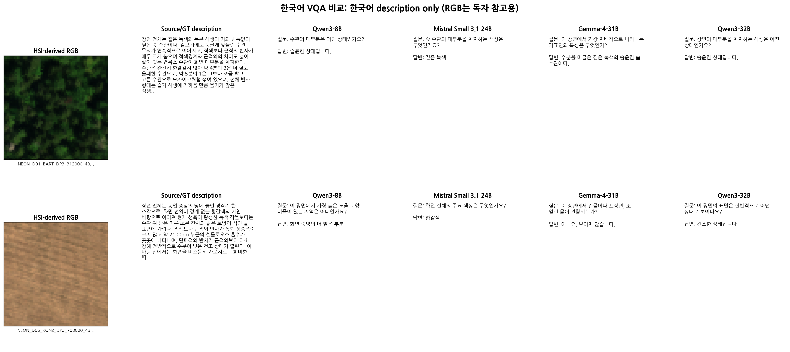
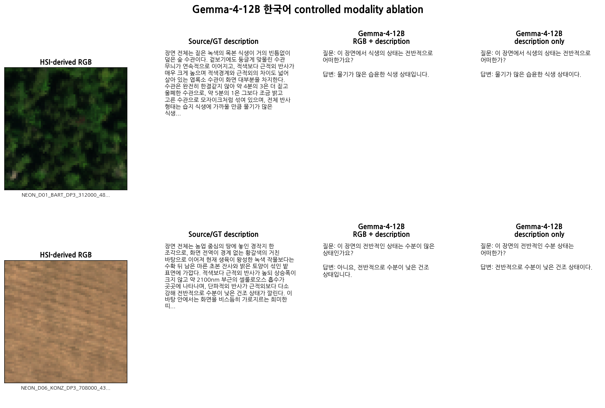
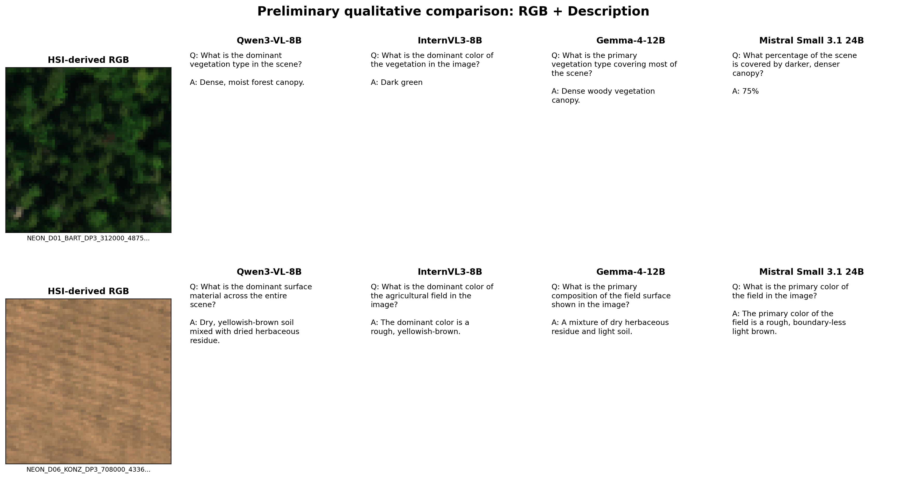
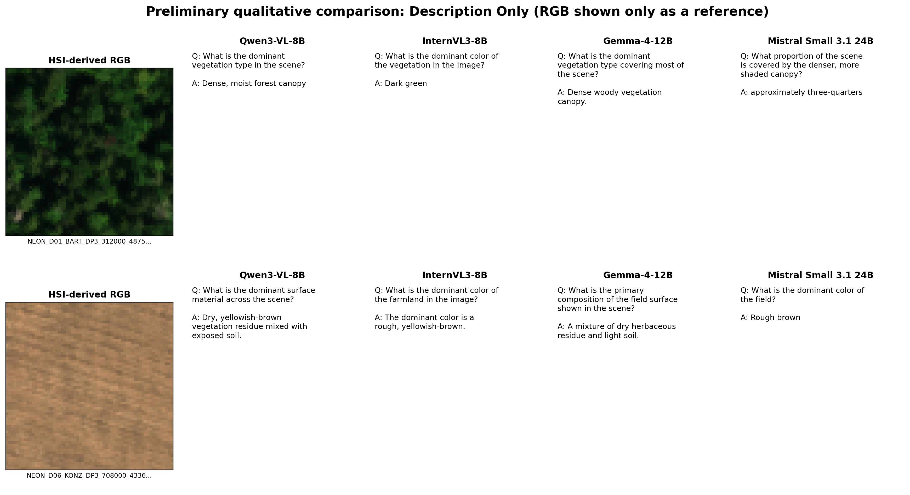
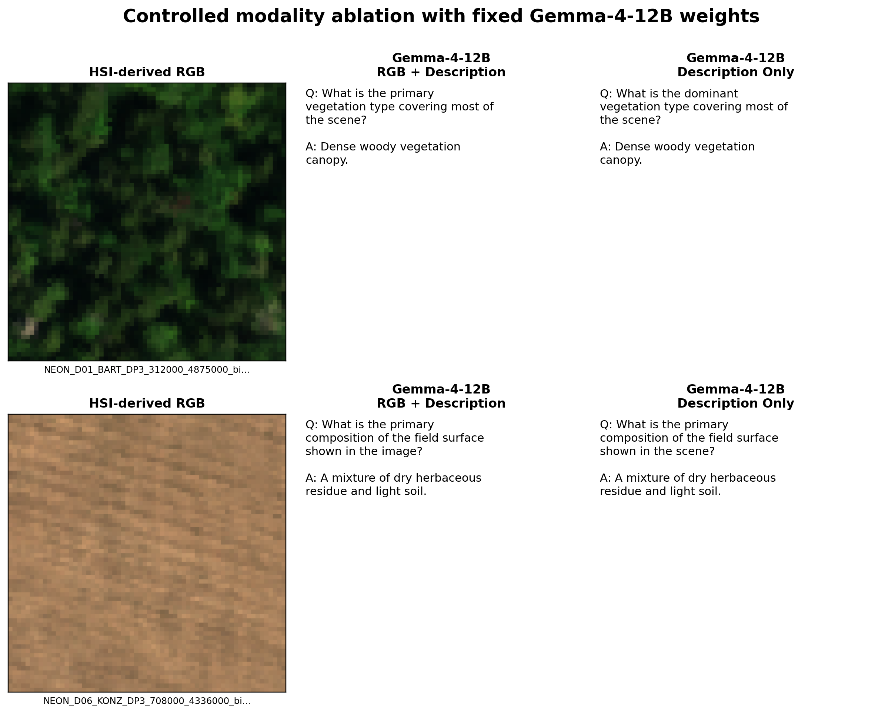

# 초기 4개 멀티모달 모델 선비교 결과

실행일: 2026-10-02 UTC
상태: **예비 결과** — 전체 11개 configuration 논문 실험의 최종 결과가 아님

> 아래의 기존 영어 VQA 선비교 결과와 그림은 재현 기록으로 그대로 보존한다. 2026-10-02에
> 별도 한국어 prompt로 다시 실행한 결과는 다음 절에 추가했다.

## 한국어 VQA 추가 비교

paired HSI description의 언어에 맞춰 `vqa-generation-ko-v1` prompt를 만들고, 다운로드와
smoke test가 끝난 모든 checkpoint를 다시 실행했다. 최종 실행은 7개 checkpoint,
11개 configuration, 고정 5개 sample의 총 220 VQA다.

- 220/220 VQA가 공통 JSONL schema와 한국어 완결성 검사를 통과했다.
- source-description cosine은 정답률이 아니라 **어휘적 grounding proxy**다.
- 자동 지표와 원문 대조 오류 사례는 [한국어 VQA 평가 문서](korean_vqa_evaluation.md)에
  수치와 함께 정리했다.
- `Source/GT description`은 HSI pipeline의 paired source text이며 gold QA answer가 아니다.

### RGB + description

### Description only

그림의 RGB는 독자 참고용이며 모델에는 전달하지 않았다. C05--C08의 네 cross-model
text-only 조건에 Gemma-4-31B와 Qwen3-32B 결과를 포함한다.

### Gemma-4-12B controlled modality ablation

전체 5개 sample 버전은 각각
[multimodal](../figures/korean_multimodal_grid_all.png),
[text-only](../figures/korean_text_only_grid_all.png),
[Gemma ablation](../figures/korean_gemma4_12b_ablation_all.png)에서 확인할 수 있다.

예비 정량 결과에서 한국어 완결률은 전 조건 1.00이었다. source cosine은 C02가 0.821로
가장 높았지만 긴 source 문장을 그대로 옮기는 경향이 포함되므로 품질 1위라는 뜻은 아니다.
Gemma-4-31B C07은 평균 10.28초/case였고 source 수치와 관계를 안정적으로 보존했다.
Qwen3-32B C08은 가장 느린 평균 10.64초/case였으며 한 질문에서 한국어 조사 오류가
관찰됐다. C05의 KONZ 한 답변과 C11의 SRER 한 답변에서는 source와 모순되는 의미
오류를 확인했다. 이 때문에 최종 논문 평가는 자동 유사도와 독립 human evaluation을 함께
사용해야 한다.

## 목적과 범위

다운로드와 서버 호환성이 먼저 확인된 네 checkpoint를 동일한 5개 sample에 적용했다.
각 checkpoint는 다음 두 입력 조건으로 실행해 모델 자체를 고정한 modality 비교도 함께 수행했다.

- multimodal condition: HSI에서 추출한 RGB + 기존 HSI 기반 description
- text-only condition: description only; image payload와 RGB path를 전달하지 않음

| Checkpoint | Multimodal | Text-only | 5-sample 결과 |
|---|---:|---:|---:|
| Qwen/Qwen3-VL-8B-Instruct | C01 | C10 | 10/10 case 성공 |
| OpenGVLab/InternVL3-8B | C02 | C11 | 10/10 case 성공 |
| google/gemma-4-12B-it | C03 | C09 | 10/10 case 성공 |
| mistralai/Mistral-Small-3.1-24B-Instruct-2503 | C04 | C06 | 10/10 case 성공 |

각 case는 VQA 4쌍을 요청했다. 성공한 40 case에서 총 160쌍이 생성되었고 모두
공통 normalized JSONL schema 검증을 통과했다. raw output과 normalized JSONL은 로컬
`outputs/early_comparison/`에 보존하되, 대용량 실행 산출물 정책에 따라 Git에는 넣지 않았다.

## 고정 sample

모든 조건이 아래 sample ID를 순서까지 동일하게 사용했다.

1. `NEON_D01_BART_DP3_312000_4875000_bidirectional_reflectance-468-532X660-724`
2. `NEON_D01_HARV_DP3_725000_4701000_bidirectional_reflectance-404-468X788-852`
3. `NEON_D06_KONZ_DP3_708000_4336000_bidirectional_reflectance-788-852X212-276`
4. `NEON_D14_SRER_DP3_506000_3520000_bidirectional_reflectance-788-852X532-596`
5. `NEON_D19_DEJU_DP3_566000_7088000_bidirectional_reflectance-532-596X724-788`

공통 설정은 temperature 0, top-p 1.0, seed 20261001, 최대 1,024 new tokens,
case당 VQA 4쌍이다. 모델 revision과 prompt hash는 각 run manifest에 고정했다.

## 실행 지표

| ID | 조건 | 유효 case / VQA | 평균 latency (s/case) | 중앙값 (s/case) | 측정 peak VRAM (GiB) | 서버 load (s) |
|---|---|---:|---:|---:|---:|---:|
| C01 | Qwen3-VL-8B, RGB + description | 5 / 20 | 1.983 | 1.941 | 116.80 | 129 |
| C10 | Qwen3-VL-8B, description only | 5 / 20 | 2.109 | 1.924 | 117.02 | 129 |
| C02 | InternVL3-8B, RGB + description | 5 / 20 | 2.083 | 2.070 | 118.01 | 128 |
| C11 | InternVL3-8B, description only | 5 / 20 | 2.050 | 2.025 | 118.20 | 128 |
| C03 | Gemma-4-12B, RGB + description | 5 / 20 | 5.167 | 5.506 | 118.47 | 218 |
| C09 | Gemma-4-12B, description only | 5 / 20 | 4.743 | 4.841 | 118.47 | 218 |
| C04 | Mistral Small 3.1, RGB + description | 5 / 20 | 4.653 | 4.758 | 117.60 | 114 |
| C06 | Mistral Small 3.1, description only | 5 / 20 | 4.441 | 4.613 | 118.26 | 114 |

peak VRAM은 `nvidia-smi`의 GPU used-memory를 100 ms 간격으로 측정한 값이다. vLLM이
`gpu-memory-utilization=0.85`로 KV cache를 선점하므로 이 숫자는 모델별 순수 추론
메모리가 아니라 **서버 예약량을 포함한 관측값**이다. 서로 다른 모델의 메모리 효율을
이 표만으로 순위화하면 안 된다. latency도 sample 5개의 단일 순차 실행값이라 통계적
성능 결론이 아니라 feasibility 지표로만 사용한다.

## 정성적 관찰

첫 번째 sample에서 Qwen3-VL, Gemma-4-12B, Mistral Small 3.1은 숲 수관의 우세
유형, 약 75%의 짙고 울폐한 수관, 중앙·우상단의 습윤 수관, 약 6%의 어두운 틈을
일관되게 질문했다. 이 모델들은 multimodal/text-only 출력이 상당히 비슷해, 이 작은
표본만으로 RGB가 추가 정보를 제공했다고 결론 내릴 수는 없다.

InternVL3는 색상·공간 질문을 만들었지만 첫 sample의 비율을 `4/3`, `5/1`처럼 잘못
표현한 출력이 multimodal과 text-only 양쪽에서 확인되었다. 따라서 schema 통과는 내용
정확성을 보장하지 않으며, correctness/hallucination은 별도 blind human evaluation이
필요하다.

전체 160쌍의 deterministic 검사는 필수 matrix cell과 pair 수를 모두 통과했다. 다만
C09(Gemma-4-12B text-only)의 한 질문이 “visible in the image”라고 표현해 image를
전달하지 않았는데도 직접 시각 접근을 주장한 것으로 경고되었고, C02의 한 sample에서는
두 질문의 token overlap이 높은 paraphrase 경고가 있었다. 이 두 항목은 자동 검사의
경고이며 최종 평가는 사람이 원 description과 RGB를 함께 보고 판정해야 한다.

동일 checkpoint 쌍의 질문 token Jaccard 평균은 Qwen3-VL 0.564, InternVL3 0.561,
Gemma-4-12B 0.493, Mistral Small 3.1 0.588이었다. 완전히 같은 질문은 각각 20쌍 중
5, 4, 2, 5개였다. 이는 두 조건의 문장 차이를 나타내는 기술 지표일 뿐, visual
contribution의 품질 점수가 아니다.

현재의 안전한 결론은 다음과 같다.

- 네 checkpoint 모두 두 입력 조건에서 공통 형식의 VQA를 안정적으로 생성했다.
- Qwen3-VL과 InternVL3는 약 2초/case, Gemma-4-12B와 Mistral Small 3.1은 약
  4.4--5.2초/case 수준이었다.
- RGB contribution 여부는 자동 문자열 유사도나 5개 sample만으로 확정할 수 없다.
- InternVL3의 수치·비율 해석 오류 때문에 human evaluation rubric이 반드시 필요하다.

## 호환성 이슈와 처리

InternVL3의 remote chat template은 vLLM이 list 형태로 정규화한 system message를 문자열과
직접 결합하면서 최초 요청이 HTTP 400으로 실패했다. system 지시의 의미는 그대로 유지하되
그 문장을 user text 앞에 인라인하는 `system_message_mode: inline_user` 예외를 C02/C11에
동일하게 적용했다. 이미지 포함 user-only 요청과 순수 text user-only 요청을 각각 재현한 뒤
두 조건 모두 smoke test를 다시 통과시켰다.

Mistral Small 3.1 24B의 최초 서버 로딩은 실패했다. 직접 원인은 vLLM 0.30.0의
Pixtral 구현이 `PixtralRotaryEmbedding`을 import하는 반면 Transformers 5.18.0에는
해당 이름이 없어 발생한 `ImportError`였다. 격리 wheel 검사로 해당 API가 존재하는
Transformers 5.10.4와 그 요구 범위를 만족하는 Tokenizers 0.22.2를 고정했다. 이후
동일 checkpoint가 정상 로드되었다. Mistral tokenizer는 `chat_template_kwargs`를 받지
않으므로 C04/C06 요청에서 그 비의미적 serving 옵션만 제외했고, 두 조건을 동일하게
smoke test한 후 5개 sample을 완료했다. checkpoint 교체는 없었다.

## 대표 출력

첫 번째 sample의 일부를 그대로 축약해 비교하면 다음과 같다.

### Multimodal condition

### Text-only condition

아래 그림의 RGB는 독자의 비교를 위한 참고이며 모델 요청에는 전달하지 않았다.

### Gemma-4-12B controlled ablation

| 조건 | 질문 | 답변 |
|---|---|---|
| Qwen3-VL RGB + description | What is the approximate proportion of darker, denser canopy compared to lighter, more open canopy? | About 75% darker and denser, 25% lighter and more open. |
| Qwen3-VL description only | What proportion of the scene is covered by darker, denser canopy? | Approximately 75% |
| InternVL3 RGB + description | What is the relative proportion of darker and lighter canopy sections? | Approximately 4/3 are darker and 5/1 are lighter |
| InternVL3 description only | What is the approximate proportion of the darker, denser water channels in the image? | Approximately 4/3 or 1.33 parts of the image. |
| Gemma-4-12B RGB + description | Where are the wetter canopies with suppressed shortwave infrared reflection concentrated? | In the central and upper right parts of the scene. |
| Gemma-4-12B description only | Where are the wetter canopies with suppressed shortwave infrared reflection concentrated? | In the central and upper right parts of the scene. |
| Mistral Small 3.1 RGB + description | What percentage of the scene is covered by darker, denser canopy? | 75% |
| Mistral Small 3.1 description only | What proportion of the scene is covered by the denser, more shaded canopy? | approximately three-quarters |

## 다음 단계

1. 평가자 2인의 blind human evaluation을 수행한다.
2. cross-model comparison과 same-checkpoint modality ablation을 분리해 분석한다.
3. 대표 2개 sample은 본문, 전체 5개는 Appendix에 배치한다.
4. 5-sample feasibility 결과와 향후 전체 데이터 실행을 구분한다.
